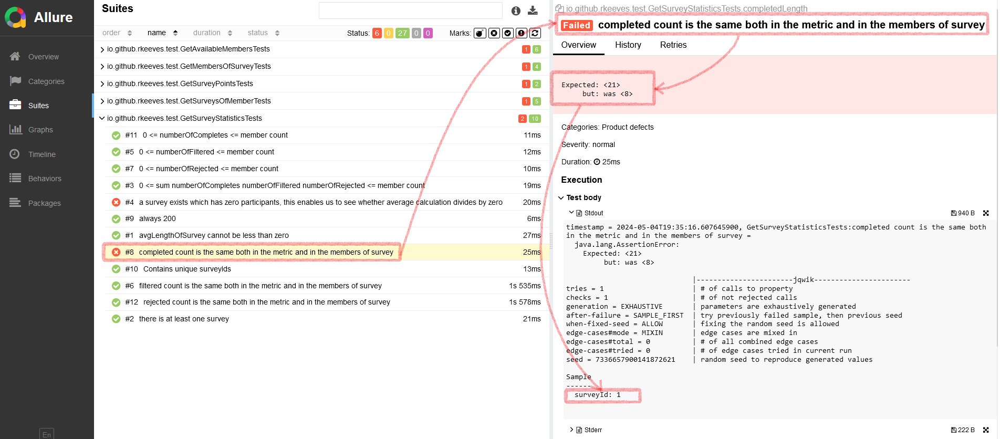

# red-apple

I was given a blackbox a short txt file and someone said:

`Your task is to write tests for the API endpoints.`

## Overview

The given test basis (tiny txt and swagger) seems to be too vague to call it a spec, we need to do a TestPlan,
we need to list out at least functional requirements in a way all stakeholders understand,
assign risks and priorities, list goes on, so many things...

Maybe it was intentional? To see whether I'd bring up this? I don't know.

But, even if I am unhappy with the test basis, I still have to deliver some kind of code to move forward... so I proceeded.

I saw 5XXs, planted bugs, nulls, and some possibilities for div by 0 and int overflow.

So instead of testing:
- I wrote some 'test's (airquotes) to strike up a conversation about refining specification
- Asked other questions (in natural language)

## 'test'

In the repo you can find 'tests' (airquotes).

Their primary purpose is to strike up conversation around certain rules of the application.

Think of these as more like 'possible talking points' than actual requirements,
as actual requirements were too vague,
and the ones I conjured up were __not approved by product owner or other stakeholders__.

For example:

`Is it true that completed count is the same both in the metric and in the members of survey?`

For formulating this kind of questions I chose jqwik.

### How to run

You'll need:
- Java 16,
- maven,
- something listening at `baseUri` defined in `api-config.properties` (default is `http://localhost:8080`),
- and an unhealthy amount of optimism to run essentially unknown code from the wild internet.

To run the tests:

```shell
mvn clean test
```

It will take some time...

After that is done, you can generate a report, and serve it from local in one fell swoop:

```shell
mvn allure:serve
```

You'll see a html report, like:



In the image above, the surveyId `1` was turned out to be a counter example to my silly rule.

_Breaking character: I guess that's one of the planted bugs or something. Be careful, saucelabs planted bugs
to the point that they cannot differentiate between planted bugs and real bugs._

I am a particularly dumb person, and I think you can come up with much better rules etc.

A lot of search space reduction can be done too.

Arbitrary value generation can be modified freely, exhaustiveness etc. and in some spaces, a simple example is enough (no need for properties or arbitraries).

I rolled with defaults, because I'm doing this in my free time on a weekend.

> Shrinking can be more interesting in certain situations than presented here.
> 
> For example: when testing stateful objects it can arrive at a short manual reproable sequence of actions. It is neat.
>
> Also, there are some [rule of thumbs](https://blog.ssanj.net/posts/2016-06-26-property-based-testing-patterns.html)
> which tend to work in really different problem domains.
> 
> If you think I'm dumb (which I am), but you like `jqwik`, please see [this document](https://johanneslink.net/how-to-specify-it/).
> This was written by a smart person, who is also honest. Aka he brings up the weaknesses too.

### Report, logs

I didn't waste much time with fluff as these rules were just made up by me in order to highlight some open questions.

Reporting comes later. Yes, it is an important topic, but not in this stage.

_And yes. I know allure is used for bloaty use case / user story like example based tests._

## Questions related specification

Aside from some code, there are many-many more questions, like:

- Are regular 5XXs acceptable?
- If 5XXs are allowed on a regular basis during service time, then should we be worried about log file sizes and performance?
- Would the API consumers benefit from more informative http status codes? (Instead of 200 and an empty array, do a 404)
- Do we have an estimate on possible data size? (lots of linear searches and concats will not scale well)
- Are the planted bugs known by all stakeholders?
- Are the null unsafe array and Map accesses known by all stakeholders?
- Is the json schema final? Did we consult with our APIs future consumers about it?
- Are we sure we want to leave input validation implicitly to SpringBoot? (e.g. when it cannot deserialize an enum it just does default behavior)
- Is someone covering the csv parsing side too?
- Can the csv have semantic problems? (there are a lot of foreign keys which can go wrong, supposedly natural numbers are treated as ints)
- Isn't the app supposed to read the Statuses from the csv?
- Are we sure we want to use csv? (A lot of validation could be offloaded via xsd or json schema if csv can be dropped)
- Are we still sure we want to use csv? (OWASP csv injection: you pull data from somewhere for cleaning, open in Excel, kaboom. I'm not a security guy though.)
- What is the expected behavior when a Survey has no participants? (aggregations like avg can - in theory - div by 0)
- What is the expected behavior when a Survey has too many participants or too high scores? (aggregations like sum can overflow)
- Are we sure that only API testing is the best approach? (it is quite time-costly, and you know, the whole 'inverted test pyramid' rant...)
- Are we ok with coding to implementation? (instead of coding to interface)
- Putting heavy business logic into private methods destroys testability. Should we be concerned about this code quality issue?
- Shouldn't we be using ctor injection whenever it is possible? (setter injection is just a hack for handling cyclic graphs)

## Questions related to Test Plan

And there are even more questions:

- Who are the stakeholders?
- Especially who are the APIs consumers?
- In what systems should we administer results, execution?
- What is the workflow for handling defects?
- Who or what is supposed to run and trigger tests?
- Is any kind of monitoring, or scheduled testing necessary too?
- The JSON content typed API might be more testable with `jest` + `supertest` + `ajv` (less language friction)
- Would the PO benefit from a more human-understandable way of testing? (gherkin or some data driven approach)
- Would the project benefit - in the long-run - from test subsets? (smoke etc.)
- What artifacts are needed? (what reports, and sometimes even logs can be helpful, but should we always generate so many data?)
- Can we move at least some part of the testing down to SpringBoot?
- Is there any kind of integration in mind? (upload the raw xml, or Azure Devops TestPlans/TestRuns, or TestRail)
- Do we have to use a dedicated test environment for the application or can we just run the app under test in a container?
- Are there any plans on the future of making this service depend on another service?
- Are we maintaining separate major versions of the app? (aka is there one single version, or do we have v1/v2/vn versions)
- Should we maintain multiple actively used versions of the test suite?
- Who owns the csv data intended for testing? (in reality it is not a csv file, so this becomes more important)
- Should we be using randomization in data? (to ensure repeatability with seed based generation)
- Is there any anticipated change to the data model and constraints? (then the test data set needs to be versioned too, and it can break tests etc.)

## Summary

I made some highly questionable code and a fat wall of text.

I also want to press that I deal with browser based tests most of the time.

So, how would I rate my non-solution?

[It was a seven.](https://youtu.be/CKtq-bZgS8I?t=278)
